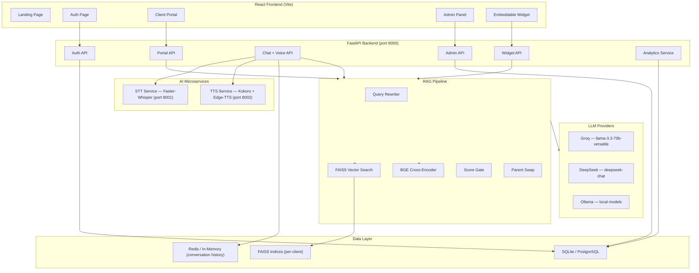

# VoiceRAG SaaS Platform — Master Progress Tracker

> **Project Vision:** A production-ready SaaS platform where clients deploy their own voice-to-voice AI assistant powered by RAG over their private documents.

---

## Architecture Overview



---

## Technology Stack

| Component | Technology | Status |
|---|---|---|
| **Frontend** | React + Vite | ✅ |
| **Backend** | FastAPI + Uvicorn (async) | ✅ |
| **STT** | Faster-Whisper (large-v3), CUDA-accelerated | ✅ |
| **TTS** | Kokoro-82M (English) + Edge-TTS (17+ languages) | ✅ |
| **LLM** | Groq (primary) / DeepSeek / Ollama (auto-resolved) | ✅ |
| **Embeddings** | all-MiniLM-L6-v2 — CUDA if available, CPU fallback | ✅ |
| **Reranker** | BAAI/bge-reranker-base — CUDA if available, CPU fallback | ✅ |
| **Vector DB** | FAISS (per-client isolated indices) | ✅ |
| **Auth DB** | SQLite (dev) / PostgreSQL (prod) via SQLAlchemy | ✅ |
| **Conversation Store** | Redis (primary) / In-Memory (fallback) | ✅ |
| **Voice Protocol** | WebSocket + Silero VAD + PCM streaming | ✅ |
| **Deployment** | Docker Compose (4 services) | ✅ |

---

## Part 1 — Core RAG + Voice Assistant (MVP)

> **Goal:** Fully functional single-user system with document upload, RAG chat, and voice-to-voice interaction.

### Phase 1.1 — Project Scaffolding

| # | Step | Status |
|---|------|--------|
| 1.1.1 | Project directory structure | ✅ |
| 1.1.2 | Python virtual environments (backend, stt, tts) | ✅ |
| 1.1.3 | FastAPI backend with health check | ✅ |
| 1.1.4 | React + Vite frontend | ✅ |
| 1.1.5 | `.env` template with all keys | ✅ |
| 1.1.6 | Frontend ↔ backend CORS | ✅ |

### Phase 1.2 — Document Processing

| # | Step | Status |
|---|------|--------|
| 1.2.1 | File upload endpoint (PDF, TXT, DOCX) | ✅ |
| 1.2.2 | Text extraction — PyMuPDF (PDF), python-docx (DOCX) | ✅ |
| 1.2.3 | Recursive text chunking (1000 char chunks, 200 overlap) | ✅ |
| 1.2.4 | HuggingFace embedding model | ✅ |
| 1.2.5 | FAISS index build and persist to disk | ✅ |
| 1.2.6 | Document delete + re-index flow | ✅ |
| 1.2.7 | Document status endpoint | ✅ |

### Phase 1.3 — RAG Chat Pipeline

| # | Step | Status |
|---|------|--------|
| 1.3.1 | LangChain + FAISS retrieval (top-k chunks) | ✅ |
| 1.3.2 | Prompt template with context injection | ✅ |
| 1.3.3 | LLM response generation | ✅ |
| 1.3.4 | `/chat` endpoint (question → answer) | ✅ |
| 1.3.5 | Conversation history (in-memory, multi-turn) | ✅ |
| 1.3.6 | Retrieval gate (no context → graceful fallback) | ✅ |
| 1.3.7 | Streaming chat responses (SSE token-by-token) | ✅ |

### Phase 1.4 — STT Microservice

| # | Step | Status |
|---|------|--------|
| 1.4.1 | Faster-Whisper FastAPI service (port 8001) | ✅ |
| 1.4.2 | `/transcribe` endpoint (WAV/WebM/MP3/OGG/FLAC/M4A) | ✅ |
| 1.4.3 | VAD filter in Whisper (min_silence_duration_ms=500) | ✅ |
| 1.4.4 | Language auto-detection with confidence score | ✅ |
| 1.4.5 | Language pinning via `language` form field | ✅ |
| 1.4.6 | CUDA device support (STT_DEVICE env) | ✅ |

### Phase 1.5 — TTS Microservice

| # | Step | Status |
|---|------|--------|
| 1.5.1 | Kokoro-82M TTS FastAPI service (port 8002) | ✅ |
| 1.5.2 | `/synthesize` endpoint (text → WAV) | ✅ |
| 1.5.3 | Kokoro: English voices, 24kHz, offline-safe | ✅ |
| 1.5.4 | Edge-TTS fallback for 17+ non-English languages | ✅ |
| 1.5.5 | Language → voice routing (en, hi, ur, ar, fr, de, zh, ja, ...) | ✅ |
| 1.5.6 | Voice pre-warm at startup (first-audio latency eliminated) | ✅ |

### Phase 1.6 — Voice Pipeline Integration

| # | Step | Status |
|---|------|--------|
| 1.6.1 | REST voice pipeline (audio → STT → RAG → TTS → audio) | ✅ |
| 1.6.2 | WebSocket real-time voice (`WS /voice/conversation`) | ✅ |
| 1.6.3 | PCM streaming (Float32 → WAV chunks → base64 → WS) | ✅ |
| 1.6.4 | Silero VAD (speech detection, auto-commit on pause) | ✅ |
| 1.6.5 | Sentence-by-sentence TTS streaming (first audio < 1s) | ✅ |
| 1.6.6 | Barge-in (echo-aware energy polling, interrupt message) | ✅ |

### Phase 1.7 — MVP Frontend

| # | Step | Status |
|---|------|--------|
| 1.7.1 | App layout with navigation (Chat / Voice / Upload) | ✅ |
| 1.7.2 | Document upload (drag-and-drop, progress bar) | ✅ |
| 1.7.3 | Document status display and delete button | ✅ |
| 1.7.4 | Chat interface with streaming responses | ✅ |
| 1.7.5 | Voice mode with animated orb (idle/listening/processing/speaking) | ✅ |
| 1.7.6 | useVoiceConversation hook (WebSocket + VAD + TTS queue) | ✅ |
| 1.7.7 | Loading states, error handling, toast notifications | ✅ |

**Part 1 — COMPLETE**

---

## Part 1.5 — Analytics & Observability

> **Goal:** Full visibility into every pipeline interaction — latency, errors, and usage patterns.

| # | Step | Status |
|---|------|--------|
| 1.5A.1 | Per-interaction trace lifecycle (start/mark/finish) | ✅ |
| 1.5A.2 | Per-stage latency tracking (STT, Retrieval, LLM, TTS) | ✅ |
| 1.5A.3 | Error capture attached to traces | ✅ |
| 1.5A.4 | `GET /analytics/conversations` with mode/status filters | ✅ |
| 1.5A.5 | `GET /analytics/summary` (counts, averages, error rate) | ✅ |
| 1.5A.6 | Chat + voice pipeline instrumentation | ✅ |
| 1.5A.7 | Frontend analytics dashboard (stat cards, conversation list, latency bars) | ✅ |
| 1.5A.8 | Auto-refresh polling (8s interval) | ✅ |

**Part 1.5 — COMPLETE**

---

## Part 2 — SaaS Multi-Tenant Platform

> **Goal:** Multi-user platform where each client has an isolated knowledge base, portal, API key, and embeddable widget.

### Phase 2.1 — Auth & Database

| # | Step | Status |
|---|------|--------|
| 2.1.1 | SQLAlchemy ORM — Client, APIKey, RefreshToken models | ✅ |
| 2.1.2 | SQLite (dev) / PostgreSQL (prod) via DATABASE_URL | ✅ |
| 2.1.3 | Registration (email, password, company_name) | ✅ |
| 2.1.4 | Login → short-lived JWT (30 min) + HTTP-only refresh cookie (7 days) | ✅ |
| 2.1.5 | Token rotation (new refresh token on each `/auth/refresh`) | ✅ |
| 2.1.6 | Email verification (token sent via SMTP, link expires 24h) | ✅ |
| 2.1.7 | Password reset (email link, token expires 1h) | ✅ |
| 2.1.8 | `get_current_client()` auth dependency for protected routes | ✅ |

### Phase 2.2 — Multi-Tenant Isolation

| # | Step | Status |
|---|------|--------|
| 2.2.1 | Per-client FAISS indices at `data/clients/{client_id}/indices/` | ✅ |
| 2.2.2 | Per-client uploads at `data/clients/{client_id}/uploads/` | ✅ |
| 2.2.3 | ClientDocumentService singleton per client (shared embedding model) | ✅ |
| 2.2.4 | Portal: upload, delete, status, chat, streaming chat | ✅ |
| 2.2.5 | Widget API key → client_id → isolated FAISS routing | ✅ |

### Phase 2.3 — API Key Management (Single Embed Key Model)

| # | Step | Status |
|---|------|--------|
| 2.3.1 | `vrag_` prefix, SHA-256 hash stored, full key shown once | ✅ |
| 2.3.2 | Auto-generate default key on registration | ✅ |
| 2.3.3 | `POST /api-keys/regenerate` — atomic revoke + create, full key returned once | ✅ |
| 2.3.4 | `GET /api-keys` — list active keys | ✅ |
| 2.3.5 | `DELETE /api-keys/{id}` — emergency revoke | ✅ |
| 2.3.6 | Usage tracking (usage_count, last_used_at updated per request) | ✅ |
| 2.3.7 | Frontend: single "Website Embed Key" card with show/hide toggle and regenerate | ✅ |

### Phase 2.4 — Embeddable Widget

| # | Step | Status |
|---|------|--------|
| 2.4.1 | `GET /widget.js` — self-contained JS served from backend | ✅ |
| 2.4.2 | `GET /widget/config` — company name, doc status (API key auth) | ✅ |
| 2.4.3 | `POST /widget/chat` — text chat via embed key | ✅ |
| 2.4.4 | `WS /widget/voice/ws` — real-time voice identical to portal pipeline | ✅ |
| 2.4.5 | Widget serves VAD assets from backend (`/vad/` static mount) | ✅ |
| 2.4.6 | Silero VAD in widget — auto speech detection, no push-to-talk | ✅ |
| 2.4.7 | Widget barge-in — echo-aware energy polling, interrupt message | ✅ |
| 2.4.8 | Language selector in widget (auto/en/hi/ur) | ✅ |
| 2.4.9 | CORS for widget from any origin (`WidgetCORSMiddleware`) | ✅ |
| 2.4.10 | Dark/light theme (data-theme), left/right position (data-position) | ✅ |
| 2.4.11 | Unread badge, smooth open/close animation, auto-grow textarea | ✅ |

### Phase 2.5 — Public Website

| # | Step | Status |
|---|------|--------|
| 2.5.1 | Landing page (hero, features, CTA) | ✅ |
| 2.5.2 | Pipeline explainer (5-stage architecture walkthrough) | ✅ |
| 2.5.3 | Auth page (login/register with form validation) | ✅ |

### Phase 2.6 — Client Portal Frontend

| # | Step | Status |
|---|------|--------|
| 2.6.1 | Three-mode routing (landing ↔ auth ↔ portal) | ✅ |
| 2.6.2 | Portal sidebar with avatar, company name, email, sign out | ✅ |
| 2.6.3 | Document upload page | ✅ |
| 2.6.4 | Chat page (streaming, conversation history, sources) | ✅ |
| 2.6.5 | Voice page with orb UI and language selector | ✅ |
| 2.6.6 | Website Embed Key page (show/hide, copy, regenerate, embed code) | ✅ |
| 2.6.7 | Analytics page (latency breakdown, filter by mode/status) | ✅ |

### Phase 2.7 — Admin Panel

| # | Step | Status |
|---|------|--------|
| 2.7.1 | Admin JWT auth (type="admin_access", 12-hour expiry) | ✅ |
| 2.7.2 | `POST /admin/login` — requires is_admin=true flag | ✅ |
| 2.7.3 | `GET /admin/stats` — platform overview (users, active, keys, calls) | ✅ |
| 2.7.4 | `GET /admin/users` — paginated user list with search | ✅ |
| 2.7.5 | User management (activate/deactivate, verify email, toggle admin, delete) | ✅ |
| 2.7.6 | Force session revocation per user | ✅ |
| 2.7.7 | Platform-wide API key audit | ✅ |
| 2.7.8 | Platform-wide analytics | ✅ |
| 2.7.9 | Admin panel frontend (dashboard, users, embed keys, analytics) | ✅ |
| 2.7.10 | Uniform icon color system in dashboard stat cards | ✅ |

**Part 2 — COMPLETE**

---

## Part 3 — Advanced RAG Pipeline

> **Goal:** Production-grade retrieval precision with minimal latency.

| # | Step | Status |
|---|------|--------|
| 3.1 | Structured PDF extraction (headings by font/bold/caps, tables as markdown) | ✅ |
| 3.2 | Hierarchical chunking: section grouping → parent/child split | ✅ |
| 3.3 | Children (small, precise) embedded in FAISS — 1000 char, 200 overlap | ✅ |
| 3.4 | Parents (full section ≤2000 chars) stored in parent_store.json | ✅ |
| 3.5 | Document outline (chapter/section list with page ranges) cached at index time | ✅ |
| 3.6 | Domain summary injected into every query prompt | ✅ |
| 3.7 | Query rewriting for follow-ups ("tell me more" → standalone question) | ✅ |
| 3.8 | FAISS dense retrieval (top 40 candidates) | ✅ |
| 3.9 | BAAI/bge-reranker-base cross-encoder reranking (top 5 survive) | ✅ |
| 3.10 | Score gate — skip LLM entirely if top rerank score < 0.0 | ✅ |
| 3.11 | Parent-child swap — matched children replaced by full parent section | ✅ |
| 3.12 | Strict grounding prompt (no hallucination, no markdown, conversational tone) | ✅ |
| 3.13 | Conversation history via Redis (in-memory fallback) | ✅ |
| 3.14 | GPU acceleration for embeddings and reranker (CUDA auto-detect) | ✅ |

**Part 3 — COMPLETE**

---

## Part 4 — Advanced Voice Pipeline

> **Goal:** Natural, low-latency conversational voice with barge-in and multilingual support.

| # | Step | Status |
|---|------|--------|
| 4.1 | WebSocket real-time voice protocol | ✅ |
| 4.2 | Silero VAD (auto speech detection, no push-to-talk required) | ✅ |
| 4.3 | PCM streaming: Float32Array → WAV → base64 → WS every 300ms | ✅ |
| 4.4 | Sentence splitter for TTS (streams audio as each sentence completes) | ✅ |
| 4.5 | AudioContext queue with decodeAudioData for gapless playback | ✅ |
| 4.6 | Echo-aware barge-in: mic vs TTS energy ratio polling (40ms interval) | ✅ |
| 4.7 | Calibration phase (first 200ms measures echo level per device/room) | ✅ |
| 4.8 | Generation tracking — stale TTS chunks dropped after interrupt | ✅ |
| 4.9 | VAD pause during TTS playback (prevents echo triggering speech start) | ✅ |
| 4.10 | Language pinning: user selects en/hi/ur; passed to Whisper + TTS | ✅ |
| 4.11 | Language selector in portal voice page + embedded widget | ✅ |
| 4.12 | Partial transcription display while STT is processing | ✅ |
| 4.13 | Identical pipeline in embedded widget (same WebSocket endpoint) | ✅ |

**Part 4 — COMPLETE**

---

## Part 5 — Performance & Optimization

> **Goal:** Sub-second retrieval, fast LLM, zero cold-start voice.

| # | Step | Status |
|---|------|--------|
| 5.1 | CUDA auto-detection for BGE reranker (RTX 5070 Ti confirmed) | ✅ |
| 5.2 | CUDA auto-detection for embedding model | ✅ |
| 5.3 | Groq API integration — 800+ tok/s vs 47 tok/s local | ✅ |
| 5.4 | Ollama local LLM fallback (qwen2.5:7b Q4_K_M, GPU) | ✅ |
| 5.5 | DeepSeek API provider option | ✅ |
| 5.6 | Kokoro voice pre-warm at TTS startup | ✅ |
| 5.7 | Shared embedding model singleton (one copy in memory across clients) | ✅ |
| 5.8 | ClientDocumentService singleton cache (index loaded once per client) | ✅ |
| 5.9 | Shared async HTTP client (connection pooling for STT/TTS calls) | ✅ |
| 5.10 | Background turn task (WS loop stays responsive during STT/RAG/TTS) | ✅ |

**Part 5 — COMPLETE**

---

## Part 6 — Cloud Deployment

> **Goal:** Production-ready containerised deployment.

| # | Step | Status |
|---|------|--------|
| 6.1 | Docker Compose: postgres, backend, stt, tts, frontend | ✅ |
| 6.2 | Health checks for all services | ✅ |
| 6.3 | Named volumes (postgres_data, backend_data, stt_models, tts_models) | ✅ |
| 6.4 | Start scripts (Windows .bat, Linux .sh) | ✅ |
| 6.5 | Cloud infrastructure setup | ⬜ |
| 6.6 | SSL/TLS + domain | ⬜ |
| 6.7 | CI/CD pipeline | ⬜ |
| 6.8 | GPU cloud instance for STT/TTS | ⬜ |
| 6.9 | CDN for frontend static assets | ⬜ |
| 6.10 | Monitoring (Prometheus / Grafana) | ⬜ |
| 6.11 | Auto-scaling | ⬜ |
| 6.12 | Security audit | ⬜ |

---

## Current System State

### What's Running

| Service | Port | Stack | GPU |
|---|---|---|---|
| FastAPI Backend | 8000 | Python 3.11, FastAPI, SQLAlchemy | CPU |
| STT Microservice | 8001 | Faster-Whisper large-v3 | CUDA (RTX 5070 Ti) |
| TTS Microservice | 8002 | Kokoro-82M + Edge-TTS | CPU |
| React Frontend | 5173 | Vite, React 18 | — |

### LLM Configuration

Currently active: **Ollama → qwen2.5:7b Q4_K_M** (GPU, ~47 tok/s)
Recommended upgrade: set `GROQ_API_KEY` in `.env` → auto-switches to **llama-3.3-70b-versatile** at ~800 tok/s

### Retrieval Pipeline Performance

| Stage | Latency |
|---|---|
| Query rewrite (if follow-up) | ~200ms (Groq) / ~1s (Ollama) |
| FAISS search (40 candidates) | < 5ms |
| BGE reranker (40 pairs, GPU) | ~15–20ms |
| Parent swap | < 1ms |
| LLM generation (~120 tokens) | ~300ms (Groq) / ~2.5s (Ollama) |
| **Total retrieval + LLM** | **~500ms (Groq) / ~4–5s (Ollama)** |

### Voice Pipeline Latency (Groq)

| Stage | Latency |
|---|---|
| VAD speech detection | realtime |
| STT (Faster-Whisper, GPU) | ~400ms |
| Retrieval + reranking | ~25ms |
| LLM first sentence | ~300ms |
| TTS first audio chunk | ~100ms |
| **Time to first spoken word** | **~850ms** |

---

## API Reference

### Public Endpoints
```
GET  /health                          System health
GET  /widget.js                       Embeddable widget JS
GET  /vad/*                           VAD assets (Silero ONNX, WASM, worklet)
```

### Auth Endpoints
```
POST /auth/register                   Register new client
POST /auth/login                      Login → JWT + refresh cookie
POST /auth/refresh                    Rotate refresh token
POST /auth/logout                     Revoke all refresh tokens
GET  /auth/me                         Current user profile
POST /auth/verify-email               Verify email with token
POST /auth/resend-verification        Resend verification email
POST /auth/forgot-password            Request password reset
POST /auth/reset-password             Reset password with token
```

### Portal (JWT required)
```
GET  /portal/document/status          Document info (has_doc, name, chunk count)
POST /portal/document/upload          Upload PDF/DOCX/TXT
DEL  /portal/document/delete          Delete current document
POST /portal/chat                     Text RAG chat (non-streaming)
POST /portal/chat/stream              Text RAG chat (SSE streaming)
GET  /portal/analytics/summary        Client's usage analytics
```

### API Keys (JWT required)
```
GET  /api-keys                        List active embed keys
POST /api-keys/regenerate             Revoke old key, generate new one
DEL  /api-keys/{id}                   Emergency revoke
```

### Widget (X-API-Key header)
```
GET  /widget/config                   Company name + doc status
POST /widget/chat                     Text chat
POST /widget/voice                    One-shot voice (audio → answer + TTS)
WS   /widget/voice/ws?api_key=&language=   Real-time voice pipeline
```

### Voice (JWT required)
```
WS   /voice/conversation?token=&language=  Real-time voice WebSocket
POST /voice/transcribe                One-shot STT
POST /voice/synthesize                One-shot TTS
POST /voice/chat                      REST voice pipeline
```

### Admin (Admin JWT required)
```
POST /admin/login
GET  /admin/stats
GET  /admin/users
POST /admin/users
GET  /admin/users/{id}
PATCH /admin/users/{id}/status
PATCH /admin/users/{id}/verify
PATCH /admin/users/{id}/make-admin
DEL  /admin/users/{id}
POST /admin/users/{id}/revoke-sessions
GET  /admin/users/{id}/api-keys
DEL  /admin/users/{id}/api-keys/{key_id}
GET  /admin/api-keys
GET  /admin/analytics
```

---

## Embedding the Widget

```html
<script
  src="https://your-server/widget.js"
  data-api-key="vrag_xxxxxxxxxxxxxxxx"
  data-api-url="https://your-server"
  data-position="right"
  data-theme="dark">
</script>
```

| Attribute | Values | Default |
|---|---|---|
| `data-api-key` | `vrag_xxx` | required |
| `data-api-url` | backend URL | inferred from script src |
| `data-position` | `left` / `right` | `right` |
| `data-theme` | `dark` / `light` | `dark` |

---

## How to Run

```bash
# 1. Backend
cd backend && venv/Scripts/activate
python main.py

# 2. STT service
cd services/stt && venv/Scripts/activate
python main.py

# 3. TTS service
cd services/tts && venv/Scripts/activate
python main.py

# 4. Frontend
cd frontend && npm run dev
```

Or use the provided scripts:
```bash
# Windows
start_all_services.bat

# Linux / Mac
./start_all_services.sh
```

Or Docker:
```bash
docker-compose up --build
```

---

## Remaining Work

| Item | Priority | Notes |
|---|---|---|
| Cloud deployment (VPS / Azure) | High | Docker Compose ready, needs cloud target |
| SSL/TLS + custom domain | High | Required for production widget embeds |
| Switch to Groq in production | High | Set GROQ_API_KEY in .env — one line change |
| CI/CD pipeline | Medium | GitHub Actions → Docker build → deploy |
| GPU cloud instance | Medium | STT/TTS GPU already coded, needs cloud GPU |
| Monitoring (Prometheus/Grafana) | Low | Nice to have for production observability |
