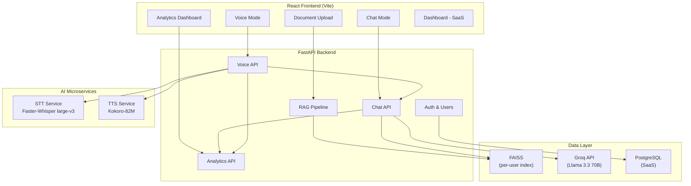

# 🎙️ Voice-to-Voice RAG AI Agent — Master Progress Tracker

> **Project Vision:** A production-ready SaaS platform where clients can deploy their own voice-to-voice AI assistant powered by RAG over their documents.

---

## 📐 Architecture Overview

---

## 🛠️ Technology Stack

| Component        | Technology                    | Rationale                                     |
| ---------------- | ----------------------------- | --------------------------------------------- |
| **Frontend**     | React + Vite                  | Fast dev, modern tooling                      |
| **Backend**      | FastAPI + Uvicorn             | Async, fast, Python-native                    |
| **STT**          | Faster-Whisper `large-v3`     | Best speed/quality ratio for transcription     |
| **TTS**          | Kokoro-82M                    | 82M params, CPU-friendly, natural voice        |
| **LLM**         | Groq API (Llama 3.3 70B)     | Ultra-fast inference via Groq hardware         |
| **RAG / Embeddings** | LangChain + Sentence-Transformers | Mature ecosystem, proven pipeline        |
| **Vector DB**    | FAISS                         | Fast, local, per-user indexing                 |
| **Auth (SaaS)**  | JWT + PostgreSQL              | Industry standard for multi-tenant             |
| **Deployment**   | Docker + Cloud                | Containerized, scalable                        |

---

## 📋 Part 1 — Core RAG + Voice Assistant (MVP)

> **Goal:** Fully functional single-user system with document upload, RAG chat, and voice-to-voice interaction.

### Phase 1.1 — Project Scaffolding & Environment

| # | Step | Status | Verification |
|---|------|--------|-------------|
| 1.1.1 | Create project directory structure | ✅ | Folders exist: `backend/`, `frontend/`, `services/stt/`, `services/tts/` |
| 1.1.2 | Initialize Python virtual environment for backend | ✅ | `venv` active, `python --version` works |
| 1.1.3 | Install core backend dependencies (FastAPI, uvicorn, python-multipart, python-dotenv) | ✅ | `pip list` shows packages |
| 1.1.4 | Initialize React frontend with Vite | ✅ | `npm run dev` starts dev server |
| 1.1.5 | Create `.env` template with all required keys | ✅ | `.env.example` exists with placeholders |
| 1.1.6 | Create basic FastAPI app with health check endpoint | ✅ | `GET /health` returns 200 |
| 1.1.7 | Verify frontend ↔ backend CORS connectivity | ✅ | Frontend fetches `/health` successfully |

### Phase 1.2 — Document Upload & Processing

| # | Step | Status | Verification |
|---|------|--------|-------------|
| 1.2.1 | Create file upload endpoint (PDF, TXT, DOCX) | ✅ | Upload via Postman returns 200 |
| 1.2.2 | Implement document text extraction (PyMuPDF, python-docx) | ✅ | Extracted text printed to console |
| 1.2.3 | Implement text chunking (RecursiveCharacterTextSplitter) | ✅ | Chunks logged with overlap verification |
| 1.2.4 | Install & configure embedding model (sentence-transformers) | ✅ | Embedding a test sentence returns vector |
| 1.2.5 | Build FAISS index from document chunks | ✅ | Index saved to disk, file exists |
| 1.2.6 | Implement document delete + re-index flow | ✅ | Delete clears index, upload replaces it |
| 1.2.7 | Add document status endpoint (has doc? doc name?) | ✅ | `GET /document/status` returns correct info |

### Phase 1.3 — RAG Chat Pipeline

| # | Step | Status | Verification |
|---|------|--------|-------------|
| 1.3.1 | Install LangChain + langchain-groq | ✅ | Import succeeds |
| 1.3.2 | Implement retrieval chain (query → FAISS → top-k chunks) | ✅ | Query returns relevant chunks |
| 1.3.3 | Build prompt template with context injection | ✅ | Prompt formatted correctly with context |
| 1.3.4 | Integrate Groq LLM for response generation | ✅ | API call returns coherent answer |
| 1.3.5 | Create `/chat` endpoint (question → answer) | ✅ | Postman test with real document works |
| 1.3.6 | Add conversation history support (in-memory) | ✅ | Follow-up questions maintain context |
| 1.3.7 | Add retrieval gate (no context → graceful fallback) | ✅ | Off-topic question gets "not in document" response |

### Phase 1.4 — STT Service (Faster-Whisper)

| # | Step | Status | Verification |
|---|------|--------|-------------|
| 1.4.1 | Create dedicated venv for STT service | ✅ | Separate venv active |
| 1.4.2 | Install faster-whisper + dependencies | ✅ | `from faster_whisper import WhisperModel` works |
| 1.4.3 | Create STT FastAPI microservice on port 8001 | ✅ | Service starts on port 8001 |
| 1.4.4 | Implement `/transcribe` endpoint (audio → text) | ✅ | Upload WAV, get transcription back |
| 1.4.5 | Test with various audio formats (WAV, WebM, MP3) | ✅ | All formats transcribed correctly |
| 1.4.6 | Optimize for latency (beam_size, compute_type) | ✅ | Transcription < 3s for 10s audio |

### Phase 1.5 — TTS Service (Kokoro)

| # | Step | Status | Verification |
|---|------|--------|-------------|
| 1.5.1 | Install espeak-ng system dependency | ✅ | Used `espeakng-loader` for native Windows support |
| 1.5.2 | Create dedicated venv for TTS service | ✅ | Separate venv active |
| 1.5.3 | Install Kokoro TTS + dependencies | ✅ | `from kokoro import KPipeline` works |
| 1.5.4 | Create TTS FastAPI microservice on port 8002 | ✅ | Service starts on port 8002 |
| 1.5.5 | Implement `/synthesize` endpoint (text → audio) | ✅ | Send text, receive WAV audio |
| 1.5.6 | Implement streaming audio response | ✅ | Audio streams as it generates |
| 1.5.7 | Test voice quality and latency | ✅ | Natural-sounding, < 2s first-audio |

### Phase 1.6 — Voice-to-Voice Pipeline Integration

| # | Step | Status | Verification |
|---|------|--------|-------------|
| 1.6.1 | Create orchestrator: audio-in → STT → RAG → TTS → audio-out | ✅ | Full pipeline works via Postman |
| 1.6.2 | Add WebSocket support for real-time voice | ✅ | WS connection established |
| 1.6.3 | End-to-end latency optimization | ✅ | Total round-trip < 5s |

### Phase 1.7 — React Frontend (MVP UI)

| # | Step | Status | Verification |
|---|------|--------|-------------|
| 1.7.1 | Create app layout with navigation (Chat / Voice / Upload) | ✅ | Pages render, navigation works |
| 1.7.2 | Build document upload component with drag-and-drop | ✅ | File uploads successfully |
| 1.7.3 | Build document status display (current doc, delete button) | ✅ | Shows doc name, delete works |
| 1.7.4 | Build chat interface (message bubbles, input, send) | ✅ | Messages send and display |
| 1.7.5 | Integrate chat with `/chat` API | ✅ | Real answers from RAG pipeline |
| 1.7.6 | Build voice mode UI (record button, waveform, playback) | ✅ | Recording starts/stops |
| 1.7.7 | Integrate voice mode with STT → Chat → TTS pipeline | ✅ | Speak → get spoken answer |
| 1.7.8 | Add loading states and error handling | ✅ | Spinners, error toasts work |
| 1.7.9 | Basic responsive design (desktop + mobile) | ✅ | Looks good on both |
| 1.7.10 | Add streaming chat responses | ✅ | Real-time token-by-token display |

### ✅ Part 1 Complete When:
- [x] User can upload a document (PDF/TXT/DOCX)
- [x] User can chat with the document via text
- [x] User can talk to the document via voice
- [x] Only one document at a time (delete + replace flow)
- [x] All services run locally and communicate via APIs

**🎉 PART 1 MVP IS COMPLETE! All core functionality is implemented and working.**

---

## 📋 Part 1.5 — Analytics & Observability Module

> **Goal:** Full visibility into every conversation, pipeline latency breakdown, and error tracking.

### Phase 1.5A — Backend Analytics Service

| # | Step | Status | Verification |
|---|------|--------|-------------|
| 1.5A.1 | Create analytics service with in-memory trace storage | ✅ | `analytics_service.py` — start/mark/finish trace lifecycle |
| 1.5A.2 | Implement per-stage latency tracking (STT, Retrieval, LLM, TTS) | ✅ | `PipelineLatency` dataclass with ms-precision timings |
| 1.5A.3 | Implement error capture within pipeline traces | ✅ | `record_error()` attaches errors to traced entries |
| 1.5A.4 | Store conversation entries (query, response, mode, timestamp) | ✅ | `ConversationEntry` with full metadata |
| 1.5A.5 | Implement summary aggregation (counts, avg latencies) | ✅ | `get_summary()` returns totals + averages |
| 1.5A.6 | Create analytics REST API (`/analytics/*`) | ✅ | `GET /conversations`, `GET /summary`, `DELETE /clear` |
| 1.5A.7 | Register analytics router in main app | ✅ | Router mounted in `main.py` |

### Phase 1.5B — Pipeline Instrumentation

| # | Step | Status | Verification |
|---|------|--------|-------------|
| 1.5B.1 | Instrument chat service (non-streaming) | ✅ | Retrieval + LLM stages traced |
| 1.5B.2 | Instrument chat service (streaming) | ✅ | Retrieval + LLM stages traced for SSE stream |
| 1.5B.3 | Instrument voice service (`_process_voice_turn`) | ✅ | STT + LLM + TTS(first-audio) stages traced |
| 1.5B.4 | Error capture in STT failures | ✅ | Timeout, connection, HTTP errors recorded |
| 1.5B.5 | Error capture in TTS failures | ✅ | Per-chunk TTS errors recorded |
| 1.5B.6 | Error capture in RAG/LLM failures | ✅ | Stream timeout + generation errors recorded |

### Phase 1.5C — Frontend Analytics Dashboard

| # | Step | Status | Verification |
|---|------|--------|-------------|
| 1.5C.1 | Add analytics API client functions | ✅ | `getAnalyticsConversations`, `getAnalyticsSummary`, `clearAnalytics` |
| 1.5C.2 | Build summary stat cards (total, chat, voice, errors) | ✅ | 4-card grid with icons |
| 1.5C.3 | Build average latency panel (STT, Retrieval, LLM, TTS, Total) | ✅ | 5-stat summary with divider |
| 1.5C.4 | Build mode/status filter controls | ✅ | Pill buttons: All/Chat/Voice × All/Success/Error |
| 1.5C.5 | Build expandable conversation list | ✅ | Rows show mode badge, query, status, latency, timestamp |
| 1.5C.6 | Build expanded detail view (query, response, errors, latency bars) | ✅ | Visual latency bars with per-stage color coding |
| 1.5C.7 | Auto-refresh polling (8s interval) | ✅ | Dashboard updates live |
| 1.5C.8 | Add Analytics nav item in sidebar | ✅ | BarChart3 icon, 4th tab |
| 1.5C.9 | Minimal, intuitive responsive CSS | ✅ | Dark glass theme, responsive grid |

### ✅ Part 1.5 Complete When:
- [x] Every chat and voice interaction is automatically logged
- [x] Users can see what was asked and what was responded
- [x] Mode indicator shows if it was chat or voice
- [x] Per-stage latency breakdown visible (STT → Retrieval → LLM → TTS)
- [x] Errors during any pipeline stage are captured and displayed
- [x] Filter by mode (chat/voice) and status (success/error)
- [x] Summary statistics with average latencies across all interactions

**🎉 PART 1.5 ANALYTICS MODULE IS COMPLETE!**

---

## 📋 Part 2 — SaaS Multi-Tenant Solution

> **Goal:** Multi-user platform where clients have their own portal, users, and analytics.

### Phase 2.1 — Database & Authentication
| # | Step | Status | Verification |
|---|------|--------|-------------|
| 2.1.1 | Set up PostgreSQL database | ⬜ | DB connection works |
| 2.1.2 | Design schema (clients, users, documents, sessions, analytics) | ⬜ | Migrations run |
| 2.1.3 | Implement JWT auth (register, login, refresh) | ⬜ | Token flow works |
| 2.1.4 | Add role-based access (admin, client, end-user) | ⬜ | Roles enforced |
| 2.1.5 | Per-user FAISS index isolation | ⬜ | Users can't access each other's docs |

### Phase 2.2 — Client Portal
| # | Step | Status | Verification |
|---|------|--------|-------------|
| 2.2.1 | Client registration & onboarding flow | ⬜ | New client can sign up |
| 2.2.2 | Client dashboard (usage stats, active users) | ⬜ | Stats display correctly |
| 2.2.3 | Embeddable widget/plugin generation | ⬜ | Plugin code generated |
| 2.2.4 | API key management for clients | ⬜ | Keys can be created/revoked |
| 2.2.5 | Usage analytics (queries, voice minutes, docs) | ⬜ | Charts render with real data |

### Phase 2.3 — End-User Management
| # | Step | Status | Verification |
|---|------|--------|-------------|
| 2.3.1 | End-user session tracking | ⬜ | Sessions logged |
| 2.3.2 | Conversation history persistence | ⬜ | History loads on return |
| 2.3.3 | User-specific document management | ⬜ | Each user has own doc |
| 2.3.4 | Rate limiting per client tier | ⬜ | Limits enforced |

### Phase 2.4 — Admin Panel
| # | Step | Status | Verification |
|---|------|--------|-------------|
| 2.4.1 | System-wide admin dashboard | ⬜ | All clients visible |
| 2.4.2 | Client management (suspend, delete, edit) | ⬜ | CRUD operations work |
| 2.4.3 | System health monitoring | ⬜ | Service statuses shown |
| 2.4.4 | Billing/subscription management (placeholder) | ⬜ | UI exists |

---

## 📋 Part 3 — Premium UI Upgrade

> **Goal:** Transform the UI into a polished, premium product with stunning aesthetics.

| # | Step | Status | Verification |
|---|------|--------|-------------|
| 3.1 | Design system creation (colors, typography, spacing) | ⬜ | Design tokens defined |
| 3.2 | Glassmorphism + dark mode theme | ⬜ | Theme applied globally |
| 3.3 | Animated voice waveform visualization | ⬜ | Real-time waveform renders |
| 3.4 | Micro-animations (transitions, hover effects, loading) | ⬜ | Smooth throughout |
| 3.5 | Professional onboarding flow | ⬜ | Guided first-use experience |
| 3.6 | Advanced chat UI (markdown, code blocks, citations) | ⬜ | Rich content renders |
| 3.7 | Mobile-first responsive redesign | ⬜ | Perfect on all devices |
| 3.8 | Accessibility audit (WCAG AA) | ⬜ | Passes automated checks |
| 3.9 | Performance optimization (lazy loading, code splitting) | ⬜ | Lighthouse > 90 |

---

## 📋 Part 4 — Cloud Deployment

> **Goal:** Production-ready deployment on cloud infrastructure.

| # | Step | Status | Verification |
|---|------|--------|-------------|
| 4.1 | Dockerize all services (backend, STT, TTS, frontend) | ⬜ | `docker-compose up` runs all |
| 4.2 | Set up CI/CD pipeline | ⬜ | Push triggers deploy |
| 4.3 | Cloud infrastructure setup (compute, storage, DB) | ⬜ | Resources provisioned |
| 4.4 | SSL/TLS + domain configuration | ⬜ | HTTPS works |
| 4.5 | GPU instance for STT/TTS services | ⬜ | Models run on GPU |
| 4.6 | CDN for frontend static assets | ⬜ | Fast global load times |
| 4.7 | Monitoring & alerting (Prometheus, Grafana) | ⬜ | Dashboards live |
| 4.8 | Auto-scaling configuration | ⬜ | Scales under load |
| 4.9 | Backup & disaster recovery | ⬜ | Backup/restore tested |
| 4.10 | Security audit & hardening | ⬜ | No critical vulnerabilities |

---

## 🚀 Current Focus: **Part 2 — SaaS Multi-Tenant Solution**

**Next Step:** 2.1.1 — Set up PostgreSQL database

> ✅ **Part 1 MVP Complete!** The core voice-to-voice RAG system is fully functional.
> 
> ✅ **Part 1.5 Analytics Complete!** Full conversation logging, pipeline latency breakdown, and error tracking dashboard.
> 
> ⚠️ **Before Starting Part 2:** Ensure you have tested the MVP end-to-end:
> 1. Upload a document via the Upload page
> 2. Test text chat on the Chat page
> 3. Test voice interaction on the Voice page
> 4. Check the Analytics page for latency and error data
> 5. Verify all three microservices are running (backend:8000, STT:8001, TTS:8002)
